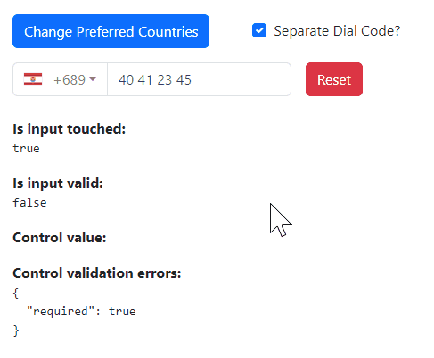

# International Telephone Input for Angular (NgxInputTel)

[](https://travis-ci.org/jlevot/ngx-input-tel) [](https://badge.fury.io/js/ngx-input-tel-intl) [](https://www.npmjs.com/package/ngx-input-tel-intl)

An Angular package for entering and validating international telephone numbers. It adds a flag dropdown to any input, detects the user's country, displays a relevant placeholder and provides formatting/validation methods.



**Compatibility:**

Validation with [google-libphonenumber](https://github.com/ruimarinho/google-libphonenumber)

| ngx-input-tel | Angular | ngx-bootstrap |
|---------------|---------|---------------|
| 16.x.x        | 16.x.x  | \>= 11.0.0    |

## Installation

### Install Dependencies

`$ npm install ngx-input-tel-intl --save`

`$ npm install google-libphonenumber --save`

`$ ng add ngx-bootstrap`

If you do not wish to use Bootstrap's global CSS, we now package the project with only the relevant
bootstrap styling needed for the dropdown. As such, you can remove the bootstrap styling from `angular.json`.

Further, Angular CLI should tree-shake the rest of Ngx-Boostrap away if you don't utilize other dependencies from
the bootstrap package. This should keep this dependency a lean feature-add

### Add Dependency Style

Add _'intl-tel-input'_ style file:

`./node_modules/ngx-input-tel-intl/build/css/input-tel-intl.css`

to **angular.json** styles array:

```json

"styles": [
"./node_modules/ngx-input-tel-intl/build/css/input-tel-intl.css",
"src/styles.css"
],

```

### Install This Library

`$ npm install ngx-input-tel --save`

## Usage

### Import

Add `NgxInputTelIntlModule` to your module file:

```javascript
imports: [NgxInputTelIntlModule];
```

You can use it by this way:

```html

<form #f="ngForm" [formGroup]="phoneForm">
    <ngx-tel-input-intl
        [favoriteCountries]="favoriteCountries"
        [enableAutoCountrySelect]="true"
        [displayPlaceholder]="true"
        [selectedCountryISO]="CountryISO.FrenchPolynesia"
        [phoneValidation]="true"
        [separateDialCode]="separateDialCode"
        [numberFormat]="PhoneNumberFormat.INTERNATIONAL"
        searchCountryField="ALL"
        cssClass="custom"
        [formControl]="phone">
    </ngx-tel-input-intl>
</form>
```

You can choose to use a formControl or just a formControlName. It depends on your needs.

## Options

| Options                  | Type                    | Default                           | Description                                                                                                   |
|--------------------------|-------------------------|-----------------------------------|---------------------------------------------------------------------------------------------------------------|
| cssClass                 | `string`                | `control-form`                    | Bootstrap input css class or your own custom one.                                                             |
| favoriteCountries        | `<CountryISO>[]`        | `[]`                              | List of countries, which will appear at the top.                                                              |
| onlyCountries            | `<CountryISO>[]`        | `[]`                              | List of manually selected countries, which will appear in the dropdown.                                       |
| enableAutoCountrySelect  | `boolean`               | `true`                            | Toggle automatic country (flag) selection based on user input.                                                |
| displayPlaceholder       | `boolean`               | `true`                            | Input placeholder text, which adapts to the country selected.                                                 |
| customPlaceholder        | `string`                | `None`                            | Custom string to be inserted as a placeholder.                                                                |
| numberFormat             | `<PhoneNumberFormat>`   | `PhoneNumberFormat.International` | Custom string to be inserted as a placeholder.                                                                |
| displaySearchCountry     | `boolean`               | `false`                           | Enables input search box for countries in the flag dropdown.                                                  |
| searchCountryField       | `<SearchCountryField> ` | `SearchCountryField.All`          | Customize which fields to search in, if `searchCountryFlag` is enabled. Use `SearchCountryField` helper enum. |
| searchCountryPlaceholder | `string`                | `'Search Country'`                | Placeholder value for `searchCountryField`                                                                    |
| maxLength                | `number`                | `None`                            | Add character limit.                                                                                          |
| selectFirstCountry       | `boolean`               | `true`                            | Selects first country from `preferredCountries` if is set. If not then uses main list.                        |
| phoneValidation          | `boolean`               | `true`                            | Disable phone validation.                                                                                     |
| inputId                  | `string`                | `phone`                           | Unique ID for `<input>` element.                                                                              |
| selectedCountryISO       | `<CountryISO>`          | `None`                            | Set specific country on load.                                                                                 |
| separateDialCode         | `boolean`               | `false`                           | Visually separate dialcode into the drop down element.                                                        |
| countryChange            | `<Country>`             | `None`                            | Emits country value when the user selects a country from the dropdown.                                        |
| lang                     | `<Country>`             | `fr`                              | Language used for country name display and search.                                                            |

## Supported Formats

Following formats are supported

- NATIONAL // Produces "044 668 18 00"
- INTERNATIONAL // Produces "+41 44 668 18 00"
- E164 // Produces "+41446681800"
